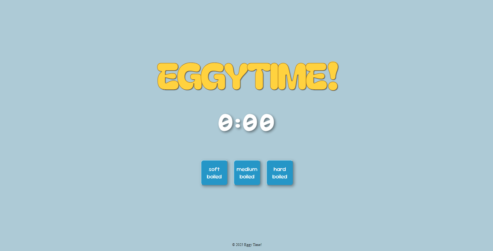
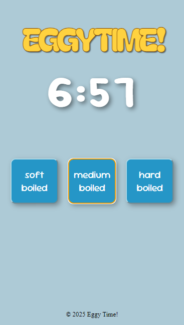

# 🥚 Egg Timer 

A simple egg timer built with HTML and JavaScript that helps you cook eggs perfectly. Choose between soft-boiled, medium-boiled, or hard-boiled, and the timer will count down to your desired cooking time. A cancel button resets the timer to 00:00.

## Live Demo:
https://jessamsaquin.github.io/Eggy-Time/

## Screenshots:

## Features:
- **Soft-boiled Timer**: Set for 4 minutes, ideal for a runny yolk and slightly firm white.
- **Medium-boiled Timer**: Set for 7 minutes, perfect for a creamy yolk and firm white.
- **Hard-boiled Timer**: Set for 12 minutes, providing a fully cooked yolk and firm white.
- **Timer Text**: The timer text itself acts as the reset button, resetting the timer to 00:00 when clicked, allowing you to start over.
- **Countdown Display**: Shows the time remaining in `mm:ss` format, updating every second for real-time feedback.
- **Alert Notification**: An alert will notify you once your egg is perfectly cooked and ready.

## Technologies:
- HTML
- JavaScript

## Credits

- **Google Fonts**: [Bagel Fat One](https://fonts.google.com/specimen/Bagel+Fat+One) for the font used in this project.
- **CSS Tricks**: For the [Text Animation](https://codepen.io/Juxtopposed/pen/OJrLZvb).
- **Sound Effect**: For the [Alarm](https://mixkit.co/free-sound-effects/alarm/).
